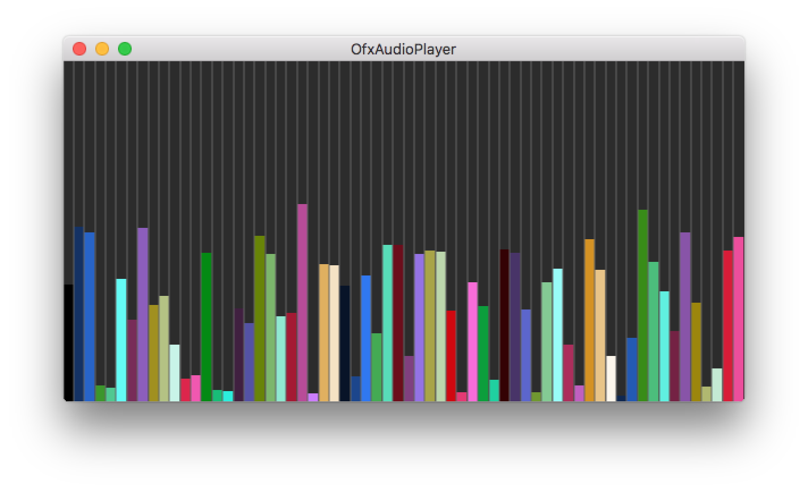

# OfxAudioPlayer

Play sounds on mouse drag with variable speed and volume and display sound spectrum.

You can take a look at the full documentation of the `ofSoundPlayer` class [here](http://openframeworks.cc/documentation/sound/ofSoundPlayer/) or at the [Sound chapter](http://openframeworks.cc/ofBook/chapters/sound.html#gettingstartedwithsoundfiles) of the ofBook.
